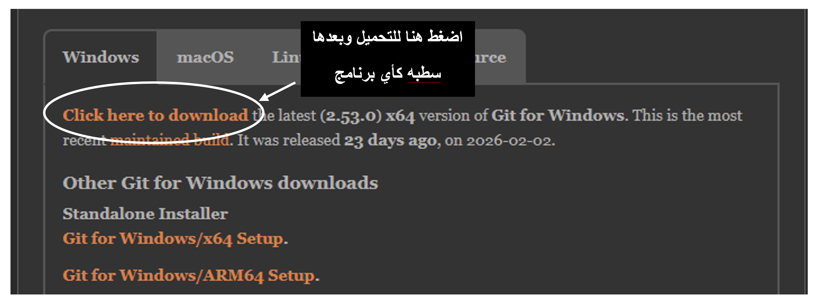

# Dalil-git-github

دليل شامل ومبسط صُمم لمساعدة المبتدئين في فهم أساسيات Git و GitHub وإدارة المشاريع البرمجية بكفاءة.

---

## 📑 الفهرس

1. [مقدمة الدليل](#section-1)
2. [أساسيات سطر الأوامر (Command Line)](#section-2)
3. [إعداد بيئة العمل (Setup)](#section-3)
4. [رحلتك الأولى مع Git (الأوامر الأساسية)](#section-4)
5. [إدارة الفروع وطلبات الدمج (Branching & PRs)](#section-5)
6. [التعاون والمساهمة في المشاريع](#section-6)
7. [احتراف واجهة وميزات GitHub](#section-7)
8. [المرجع السريع لأوامر Git (Cheat Sheet)](#section-8)
9. [فريق العمل](#section-9)

---

## 1. مقدمة الدليل

### الهدف من هذا الدليل والفئة المستهدفة
### ما هو الـ Version Control ولماذا يحتاجه كل مطور محترف
### الفروقات الجوهرية بين نظام Git ومنصة GitHub
[⬆️ العودة إلى الفهرس](#toc)

---

## 2. أساسيات سطر الأوامر (Command Line)

### ما هو الـ Command Line ولماذا يستخدمه المطورون
### الفرق بين المجلدات (Folders) والملفات (Files)
### أوامر التنقل الأساسية لإنشاء، نقل، نسخ، وحذف الملفات بثقة
### شرح مبسط للفرق بين المسار المطلق (Absolute Path) والمسار النسبي (Relative Path)
[⬆️ العودة إلى الفهرس](#toc)

---

## 3. إعداد بيئة العمل (Setup)

### خطوات تثبيت Git ومحرر الأكواد VS Code
### 📥 روابط التحميل الرسمية:

* [تحميل برنامج Git](https://git-scm.com/downloads)
 بعد الدخول اتبع الخطوات 
 ###

### التحميل لنظام ويندوز

### للتحميل لنظام Mac OS 
* [فيديو الشرح ](https://youtu.be/KplS0y0Mx00?si=XjT3HeNR-fZFeV4q)
### تحميل vs code
* [رابط تحميل vs code ](https://code.visualstudio.com/download)

### طريقة إنشاء حساب احترافي على منصة GitHub
[⬆️ العودة إلى الفهرس](#toc)

---

## 4. رحلتك الأولى مع Git (الأوامر الأساسية)

### كيفية إنشاء أول مشروع وإدارته عبر أوامر `init`, `add`, `commit`, `log`
### ملف تجاهل الملفات (`.gitignore`)
### معايير كتابة الـ Commits (Commit Conventions)
### طريقة ربط المشروع المحلي بمستودع GitHub ورفعه بنجاح
### حل مشاكل الحفظ التلقائي (AutoSave)
### سير العمل الصحيح (Workflow) المتبع عند رفع أي تعديلات برمجية جديدة
### التراجع عن الأخطاء (Undoing Mistakes)
[⬆️ العودة إلى الفهرس](#toc)

---

## 5. إدارة الفروع وطلبات الدمج (Branching & PRs)

### مفهوم الـ Branching وكيفية عزل التعديلات عن النسخة الرئيسية
### كيفية عمل Pull Request لمراجعة التعديلات قبل دمجها
### كابوس المبتدئين: حل النزاعات (Merge Conflicts)
### محاكاة الرحلة الحقيقية لفرق العمل البرمجية باستخدام الفروع
[⬆️ العودة إلى الفهرس](#toc)

---

## 6. التعاون والمساهمة في المشاريع

### استخدام أمر `git clone` لنسخ أي مشروع إلى جهازك المحلي
### فهم الفرق بين إضافة متعاون (Collaborator) وأخذ نسخة (Fork)
### سير العمل الكامل للمساهمة في مشاريع مفتوحة المصدر (Open Source)
### كيفية إرسال Pull Requests لمشاريع خارجية بنجاح
[⬆️ العودة إلى الفهرس](#toc)

---

## 7. احتراف واجهة وميزات GitHub

### تصميم Profile README مميز لترك انطباع أولي احترافي
### طريقة حفظ المشاريع المفيدة باستخدام النجمات (Stars)
### مشاركة المقتطفات البرمجية السريعة عبر أداة Gist
### دور أدوات التنظيم المتقدمة مثل Projects, Organizations, و Codespaces في إدارة المشاريع
[⬆️ العودة إلى الفهرس](#toc)

---

## 8. المرجع السريع لأوامر Git (Cheat Sheet)

[⬆️ العودة إلى الفهرس](#toc)

---

## 9. فريق العمل

تم إنشاء هذا الدليل بواسطة:
* **[اسم العضو 1]** - (يمكنك إضافة رابط حسابه على GitHub هنا)
* **[اسم العضو 2]** - (يمكنك إضافة رابط حسابه على GitHub هنا)
* **[اسم العضو 3]** - (يمكنك إضافة رابط حسابه على GitHub هنا)

[⬆️ العودة إلى الفهرس](#toc)